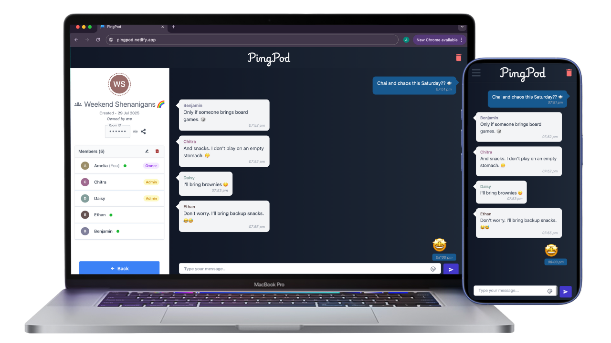

# Pingpod Backend

This is the backend service for **Pingpod** — a real-time chat application featuring dynamic room-based messaging, built with Spring Boot and WebSocket support.

> 🎯 Designed to demonstrate clean architecture, real-time communication, and practical backend engineering using modern tools.

---

## ⚙️ Features

- Real-time messaging with **Spring Socket (WebSocket)**
- **Cookie-based authentication** for secure user sessions
- Create, join, leave, and delete **rooms**
- Assign or remove **admin roles** within rooms
- Fetch user-specific and public rooms
- Room metadata handling for room info UI
- Fetch messages in page chunks

---

## 🛠 Tech Stack

- **Backend**: Spring Boot, Spring Socket
- **Auth**: Cookie-based session management
- **Database**: PostgreSQL
- **Frontend** (separate repo): React, Redux, Tailwind CSS, Material UI

---

## 🔗 Repositories

- **Frontend Repository**: *[PingPod Client Repository](https://github.com/thealkeshgupta/pingpod-client)*
- **Live App URL**: *[PingPod App](https://pingpod.netlify.app/)*

---

## 📁 About the Project

Pingpod was built to showcase:

- WebSocket-based communication with Spring Boot
- Scalable and modular backend architecture
- Clean integration with a modern frontend stack
- Practical implementation of authentication and room-based chat systems

---

## 📄 License

MIT License © Alkesh Gupta
